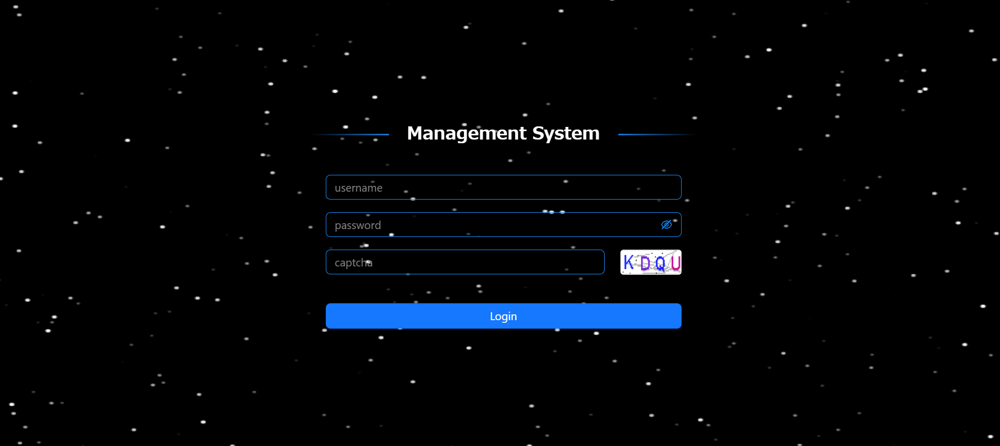

# react-management

This is a react typescript template for fast development of Back Office Management System.

With this template, you can easily develop your own application.

## Feature

- Provide routing guard for Login
- Use canvas to provide dynamic starry sky login page
  - five movement patterns triggered by mouse click (up, down, right, left, stop)
- Simulate large-scale development with using the module management for sass and status
- Use Ant Design to provide uniform uniform user experience
- Use Mockjs to simulate the API response
- Provide both sync and async usage of redux

## Main tech stack

| tech      | category          | Description                                                  |
| --------- | ----------------- | ------------------------------------------------------------ |
| redux     | status management | provide module management of status & vuex-like advanced status setting |
| thunk     | status management | provide async process ability for redux                      |
| reset-css | style             | reset all default HTML tags' styles                          |
| antd      | style             | UI framework                                                 |
| sass      | style             | use global and module mode to provide css setting            |
| mockjs    | mock              | provide mock data for this frontend project                  |
| vite      | server            | provide fast developing experience and easy environment variables setting |
